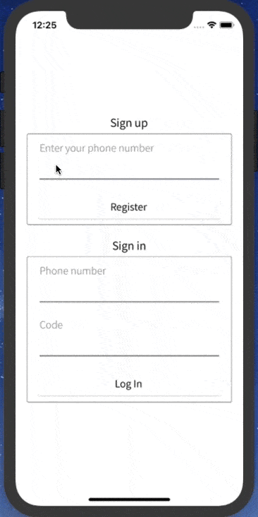
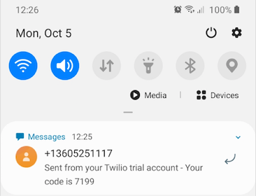

# Firebase-auth

To be used coupled with https://github.com/bashmentarium/firebase-serverless-auth-functions

The application has two forms:
1. Sign up form
Allows you to sign up into the application by providing your telephone number. The telephone number is used to send you back a message with a one-time authentication password.
2. Login form
Allows you to log into the application by providing your telephone number that serves as your username, alongside with the authentication password that you received in the text message.

# Demo

# Text message with the one-time password
Use it to authenticate yourself into the app.

